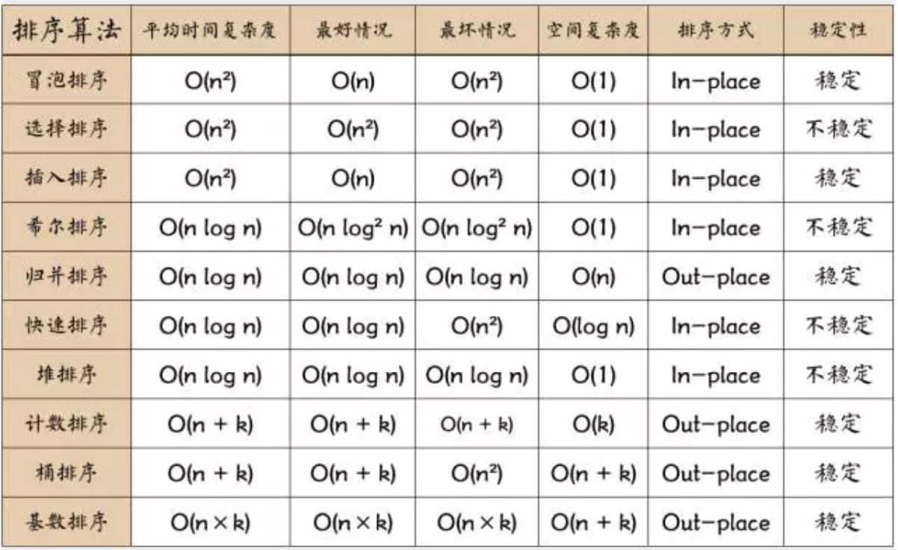

## 冒泡排序

## 选择排序

表现最稳定的排序算法之一，因为无论什么数据进去都是O(n²)的时间复杂度。

## 插入排序
思路，打扑克 牌大小排序。
插入排序和冒泡排序一样，也有一种优化算法，叫做拆半插入。

## 归并排序 mergeSort

作为一种典型的分而治之思想的算法应用，归并排序的实现由两种方法：

- 自上而下的递归（所有递归的方法都可以用迭代重写，所以就有了第2种方法）
- 自下而上的迭代

《数据结构与算法JavaScript描述》:

> However, it is not possible to do so in JavaScript, as the recursion goes too deep for the language to handle.

>然而,在 JavaScript 中这种方式不太可行,因为这个算法的递归深度对它来讲太深了。

## 堆排序

## 计数排序
计数排序的核心在于将输入的数据值转化为键存储在额外开辟的数组空间中。作为一种线性时间复杂度的排序，计数排序要求输入的数据必须是有确定范围的整数。

## 桶排序
桶排序是计数排序
的升级版。它利用了函数的映射关系，高效与否的关键就在于这个映射函数的确定。

为了使桶排序更加高效，我们需要做到这两点：

- 在额外空间充足的情况下，尽量增大桶的数量
- 使用的映射函数能够将输入的N个数据均匀的分配到K个桶中
同时，对于桶中元素的排序，选择何种比较排序算法对于性能的影响至关重要。

#### 什么时候最快
当输入的数据可以均匀的分配到每一个桶中

#### 什么时候最慢
当输入的数据被分配到了同一个桶中

## 基数排序
基数排序有两种方法

- MSD 从高位开始进行排序
- LSD 从低位开始进行排序

基数排序 vs 计数排序 vs 桶排序
这三种排序算法都利用了桶的概念，但对桶的使用方法上有明显差异：

- 计数排序：每个桶只存储单一键值
- 桶排序：每个桶存储一定范围的数值
- 基数排序：根据键值的每位数字来分配桶

