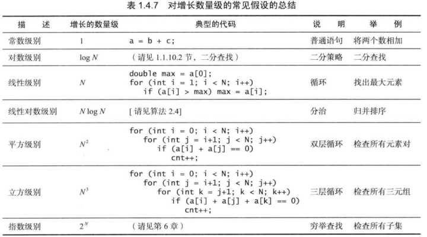
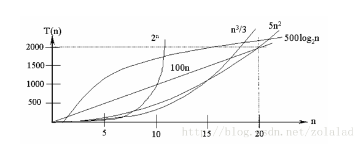

# 常见排序算法 & 数据结构
## 目录

1. 时间复杂度、空间复杂度
2. 常见排序算法

- 冒泡排序、优化
- 选择排序
- 插入排序、折半插入
- 希尔排序
- 归并排序
- 快速排序的几种写法
- 计数排序
- 桶排序
- 基数排序

3. 常见数据结构
- 链表(链表反转、链表是否有环)
- 树(高度、前序、中序、后序、广度优先算法、反转)

4. 几个题目

- 二叉搜索算法
- 青蛙跳台阶问题-斐波那契数列
- 一个无序数组，求第K大的那个数
- react虚拟Dom diff算法思路
- 最小编辑距离算法


## 时间复杂度 O(f(n))
* 问题规模 n

算法输入的参数

* 时间频度 T(n)

一个算法中的语句执行次数称为语句频度或时间频度

1. 一个算法执行所耗费的时间，从理论上是不能算出来的，必须上机运行测试才能知道。
2. 但我们不可能也没有必要对每个算法都上机测试，只需知道哪个算法花费的时间多，哪个算法花费的时间少就可以了。


* O表示法

若有某个辅助函数f(n), 使得

```
T(n) <= f(n) * k
// n趋近于无穷大，k为不等于0的常数值

O(2n^2 + n + 1)
O(3n^2 + n + 3)
O(7n^2 + n) = O(n^2)
```


则称f(n)是T(n)的同数量级函数，记作：
```
T(n) = O(f(n))
```
以最坏的情况考虑

常见的时间复杂度:



